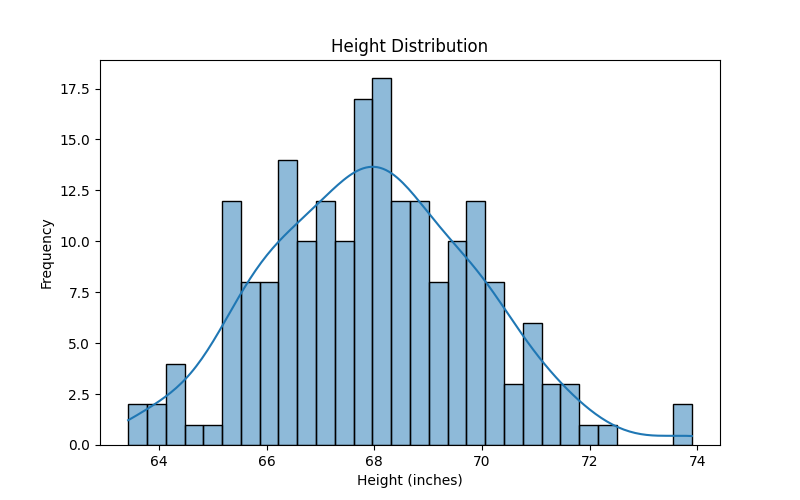
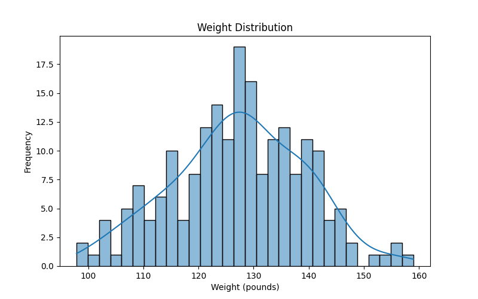
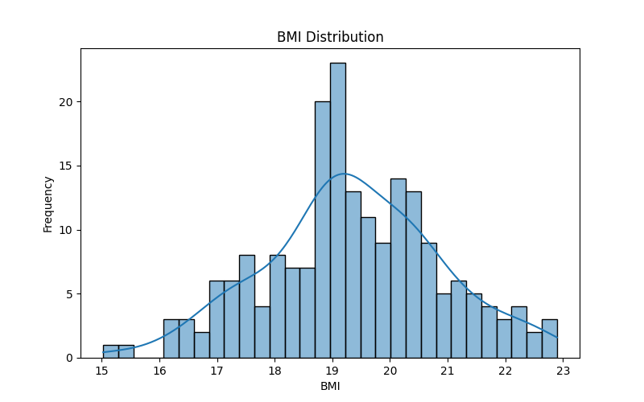
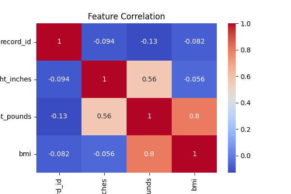

# Cloud Healthcare Analytics Pipeline

A **cloud-native healthcare and digital pharmacy analytics pipeline** built using Google Cloud, BigQuery ML, and Python.

This project demonstrates how healthcare datasets can be processed at scale, analysed using SQL, and used to train machine learning models for prescription demand forecasting and healthcare insights.

---

# Project Goals

This project was designed to achieve two objectives:

1. Prepare reusable tools for a **Data & AI Hackathon (Healthcare Track)**.
2. Build a **portfolio-grade cloud ML pipeline** demonstrating cloud data engineering and machine learning workflows.

---

# Key Features

• Scalable healthcare data processing using BigQuery
• Cloud storage staging using Google Cloud Storage
• Data transformation and feature engineering using SQL
• Machine learning models built using BigQuery ML
• Forecasting models for prescription demand
• Classification models for high-cost prescriptions
• Python notebooks for analysis and visualisation

---

# System Architecture

Healthcare Dataset
↓
Cloud Storage (data staging)
↓
BigQuery Raw Tables
↓
BigQuery Data Processing (SQL)
↓
BigQuery ML Models
↓
Python Analysis & Visualisation

## Pipeline Stages

The analytics system follows a multi-stage cloud pipeline:

1. Data ingestion into BigQuery
2. Data cleaning and preprocessing
3. Feature engineering (BMI calculation)
4. Exploratory data analysis using Python
5. Machine learning model training using BigQuery ML
6. Model evaluation and predictions
7. Time-series prescription demand forecasting
---

## Machine Learning Tasks

### Classification

Predict whether a prescription is likely to exceed a cost threshold.

Potential use cases:

• healthcare cost monitoring  
• anomaly detection  
• prescription pattern analysis  


### Regression

Predict patient weight from height using a regression model built with BigQuery ML.

Potential use cases:

• health metric estimation  
• missing value estimation in clinical datasets  
• statistical modelling of health indicators  


### Time-Series Forecasting

Forecast future prescription demand using ARIMA models in BigQuery ML.

Potential use cases:

• pharmacy inventory planning  
• medication demand forecasting  
• healthcare supply chain optimisation

---

# Technology Stack

• Google Cloud Platform
• BigQuery
• BigQuery ML
• Cloud Storage
• Python
• Pandas
• Matplotlib
• Jupyter Notebooks

---

# Project Structure

```
architecture/   System architecture documentation
data/           Sample datasets
docs/           Project documentation
notebooks/      Data analysis notebooks
scripts/        Pipeline scripts
sql/            BigQuery SQL queries
```
## Documentation

Detailed project documentation is available in the following files:

• architecture/system_architecture.md  
• architecture/system_design.md  
• docs/pipeline_overview.md  
• docs/cloud_infrastructure.md  
• docs/data_ingestion.md

---

## Exploratory Data Analysis

The dataset was analysed using a Python notebook connected to BigQuery.  
The following visualisations were generated to understand feature distributions and relationships.

## Height Distribution



This plot shows the distribution of height values in the dataset.

---

## Weight Distribution



This visualisation shows how weight values are distributed across the dataset.

---

## BMI Distribution



BMI values were calculated as part of the feature engineering phase and visualised to understand the spread of health metrics.

---

## Feature Correlation



The correlation heatmap highlights relationships between the variables:

* height
* weight
* BMI

---

## Dashboard

An interactive dashboard was built using Streamlit to visualise:

• exploratory data analysis  
• regression model predictions  
• prescription demand forecasting  

The dashboard connects directly to BigQuery and provides real-time analytics.

---

# Author

**Kaustubh Kaushal**
MSc Advanced Computer Science (Data Analytics)
University of Leeds

## Project Status

This project implements a complete cloud-native healthcare analytics pipeline including:

• scalable data ingestion using BigQuery  
• SQL-based data cleaning and feature engineering  
• exploratory data analysis using Python  
• machine learning models using BigQuery ML  
• regression, classification, and forecasting models  

The system demonstrates an end-to-end workflow for building cloud-based healthcare analytics solutions.
